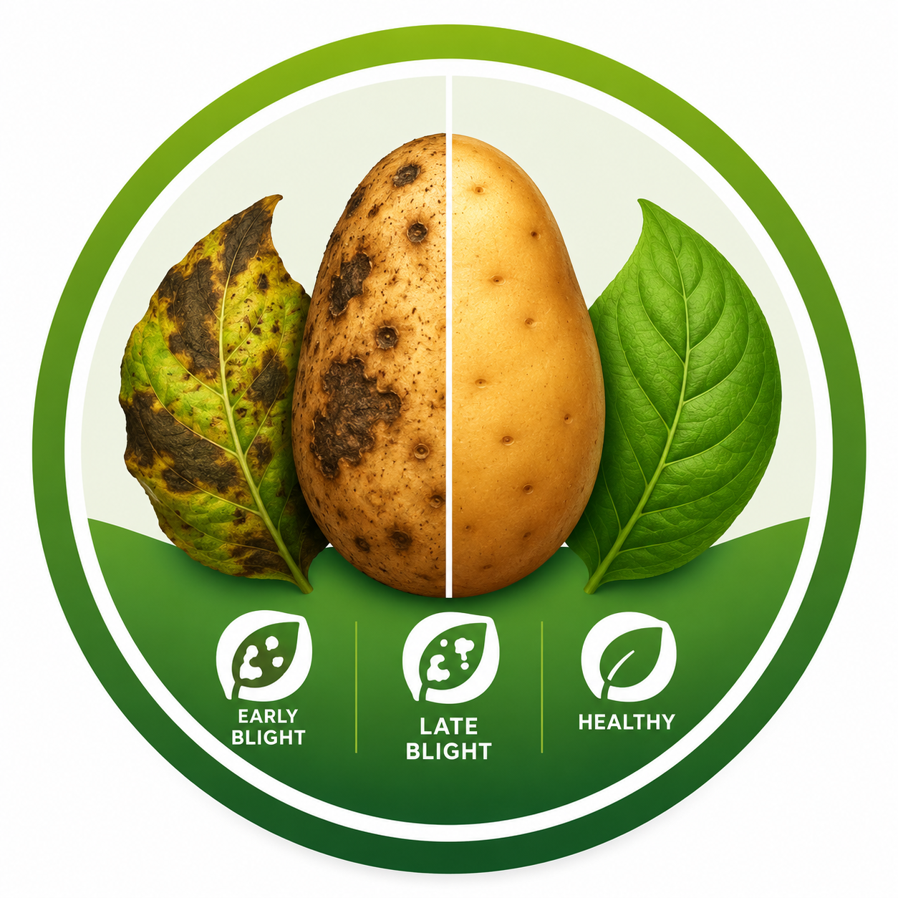
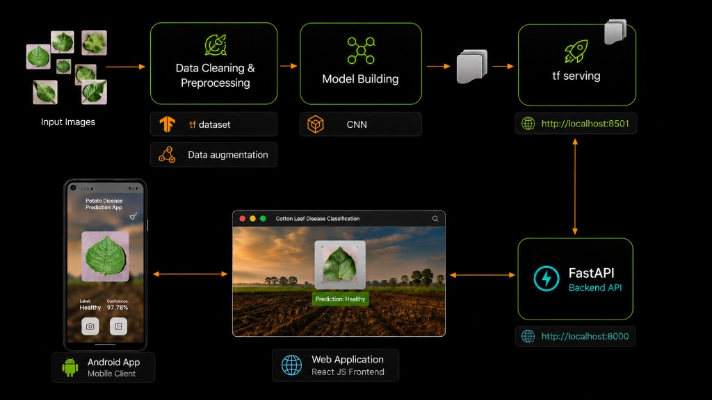

<p align="center">
  
</p>

<h1 align="center">Potato Disease Classification</h1>

<p align="center">
  <strong>Android mobile app potato leaf disease detection</strong>
</p>

<p align="center">
  <em>Early Blight · Late Blight · Healthy — from photo to prediction in seconds</em>
</p>

> End-to-end **Deep Learning** project: train a CNN on potato leaf images, serve predictions via **FastAPI** / **TensorFlow Serving**, deploy on **Google Cloud**, and deliver results through a **React Native** mobile app and **React** web UI.

<p align="center">  
  
  
  
  
</p>

### About

Farmers lose yield to **Early Blight** and **Late Blight**. This app helps identify potato leaf health from a photo in seconds.

| | |
|---|---|
| **Classes** | Early Blight · Late Blight · Healthy |
| **Model** | CNN (256×256), trained on [PlantVillage](https://www.kaggle.com/arjuntejaswi/plant-village) potato images |
| **Test accuracy** | ~94% (held-out set from training notebook) |
| **Mobile** | Camera / gallery → live prediction via cloud API |
| **Stack** | Jupyter · FastAPI · TF Serving · GCP · React · React Native |


## Demo Video
<h2>Demo Video</h2>

<video width="700" controls>
  <source src="./Demo.mp4" type="video/mp4">
  Your browser does not support the video tag.
</video>

## Architecture

<p align="center">
  
</p>

## Setup for Python:

1. Install Python ([Setup instructions](https://wiki.python.org/moin/BeginnersGuide))

2. Install Python packages

```
pip3 install -r training/requirements.txt
pip3 install -r api/requirements.txt
```

3. Install Tensorflow Serving ([Setup instructions](https://www.tensorflow.org/tfx/serving/setup))

## Setup for ReactJS

1. Install Nodejs ([Setup instructions](https://nodejs.org/en/download/package-manager/))
2. Install NPM ([Setup instructions](https://www.npmjs.com/get-npm))
3. Install dependencies

```bash
cd frontend
npm install --from-lock-json
npm audit fix
```


## Setup for React-Native app

1. Go to the [React Native environment setup](https://reactnative.dev/docs/environment-setup), then select `React Native CLI Quickstart` tab.  

2. Install dependencies

```bash
cd mobile-app
yarn install
```

  - 2.1 Only for mac users
```bash
cd ios && pod install && cd ../
```

## Training the Model

1. Download the data from [kaggle](https://www.kaggle.com/arjuntejaswi/plant-village).
2. Only keep folders related to Potatoes.
3. Run Jupyter Notebook in Browser.

```bash
jupyter notebook
```

4. Open `training/potato-disease-training.ipynb` in Jupyter Notebook.
5. In cell #2, update the path to dataset.
6. Run all the Cells one by one.
7. Copy the model generated and save it with the version number in the `models` folder.

## Running the API

### Using FastAPI

1. Get inside `api` folder

```bash
cd api
```

2. Run the FastAPI Server using uvicorn

```bash
uvicorn main:app --reload --host 0.0.0.0
```

3. Your API is now running at `0.0.0.0:8000`

### Using FastAPI & TF Serve

1. Get inside `api` folder

```bash
cd api
```

```bash
docker run -t --rm -p 8501:8501 -v C:/Users/anand/OneDrive/Alliance University/ml/potato-disease-classification tensorflow/serving --rest_api_port=8501 --model_config_file=/potato-disease-classification/models.config
```

2. Run the FastAPI Server using uvicorn
   For this you can directly run it from your main.py or main-tf-serving.py using pycharm run option (as shown in the video tutorial)
   OR you can run it from command prompt as shown below,

```bash
uvicorn main-tf-serving:app --reload --host 0.0.0.0
```

3. Your API is now running at `0.0.0.0:8000`

## Running the Frontend

1. Get inside `api` folder

```bash
cd frontend
```
2. Run the frontend

```bash
npm run start
```

## Running the app

1. Get inside `mobile-app` folder

```bash
cd mobile-app
```

2. Run the app (android/iOS)

```bash
npm run android
```

or

```bash
npm run ios
```

4. Creating public ([signed APK](https://reactnative.dev/docs/signed-apk-android))


## Deploying the TF Model (.h5) on GCP

1. Create a [GCP account](https://console.cloud.google.com/freetrial/signup/tos?_ga=2.25841725.1677013893.1627213171-706917375.1627193643&_gac=1.124122488.1627227734.Cj0KCQjwl_SHBhCQARIsAFIFRVVUZFV7wUg-DVxSlsnlIwSGWxib-owC-s9k6rjWVaF4y7kp1aUv5eQaAj2kEALw_wcB).
2. Create a [Project on GCP](https://cloud.google.com/appengine/docs/standard/nodejs/building-app/creating-project) (Keep note of the project id).
3. Create a [GCP bucket](https://console.cloud.google.com/storage/browser/).
4. Upload the tf .h5 model generate in the bucket in the path `models/potato-model.h5`.
5. Install Google Cloud SDK ([Setup instructions](https://cloud.google.com/sdk/docs/quickstarts)).
6. Authenticate with Google Cloud SDK.

```bash
gcloud auth login
```

7. Run the deployment script.

```bash
cd gcp
gcloud functions deploy predict --runtime python311 --trigger-http --memory 512 --project project_id
```

8. Your model is now deployed.
9. Use Postman to test the GCF using the [Trigger URL](https://cloud.google.com/functions/docs/calling/http).

Inspiration: https://cloud.google.com/blog/products/ai-machine-learning/how-to-serve-deep-learning-models-using-tensorflow-2-0-with-cloud-functions

---

## Project structure

```
mobile-app/     React Native app (Android / iOS)
frontend/       React web upload UI
api/            FastAPI prediction server
gcp/            Google Cloud Function deployment
training/       Jupyter notebooks & model training
saved_models/   Exported TensorFlow models
docs/           Demo video & architecture diagram
```

## Skills demonstrated

- Image classification with **TensorFlow / Keras** (CNN, augmentation, train/val/test split)
- **REST API** design and integration (FastAPI, multipart upload)
- **Cloud ML deployment** (GCS model storage, HTTP Cloud Function)
- **Cross-platform mobile** development (permissions, camera, gallery, API calls)
- **Full-stack** delivery: data → model → API → web & mobile clients

---
**Anand Hatti** · [LinkedIn](https://www.linkedin.com/in/mt-anand/) · [GitHub](https://github.com/anand-tech-sys) · [Email](anandhatti@email.com)

